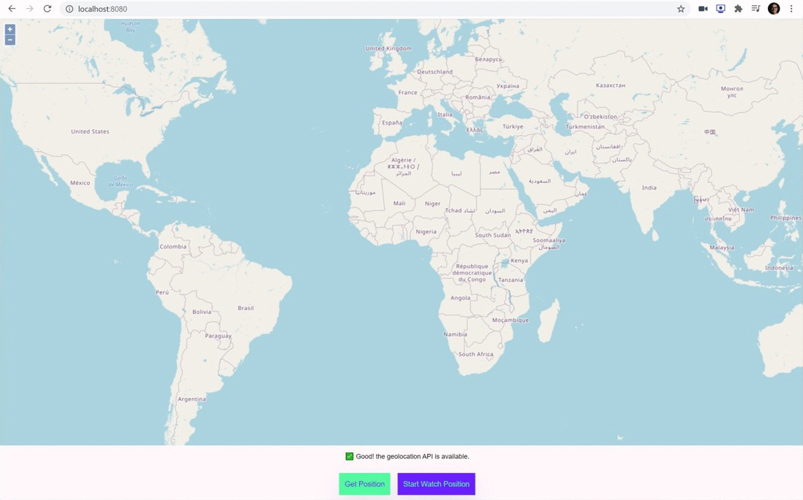

<h1 align="center">Tutorial JavaScript Navigator Geolocation</h1>

<p align="center">📍 Get with JavaScript the real Geographic Location of a user. Improve the user experience with the Geolocation.</p>

<p align="center">
  <a title="MIT License" href="LICENSE.md">
    
  </a>
  <a title="Twitter: JoseJ_PR" href="https://twitter.com/JoseJ_PR">
    
  </a>  
  <a title="Github: Sponsors" href="https://github.com/sponsors/JoseJPR">
    
  </a>
  <br />
  <br />
</p>

<p align="center">
  
</p>

## 📐 How to work with this project

You have to do the following steps to be able to work with this project.

### 1️⃣ Install NodeJS Dependencies

```bash
$npm i
```

### 2️⃣ Run

```bash
$npm run start
```

Open: localhost:8080

## 🎮 How to include and work with this library in your project?

### 1️⃣ Include the library in your project.

Copy the "geolocation.js" file into your project.

### 2️⃣ Create a new js file, for example "app.js" and add the following lines:

```js
/** Import Main Dependencies */
import geolocation from './geolocation.js';

// Get current position method.
geolocation.getCurrentPosition();

// Init document listener for get success or error.
document.addEventListener('getCurrentPositionSuccess', (data) => {
  const { coords, timestamp } = data.details;
  const { latitude, longitude } = coords;
  console.log(`🌎 Lng: ${longitude.toFixed(4)} \ Lat: ${latitude.toFixed(4)} | 🕜: ${timestamp}`);
});
document.addEventListener('getCurrentPositionError', (event) => {
  console.error('getCurrentPositionError', event);
  leyendGeolocation.innerHTML = event.error.message;
});
```

### 3️⃣ Add the reference to your js file in your html file, for example "app.js" (it is important to add it as a module):

```js
<script type="module" src="js/app.js"></script>
```

## 📂 Code scaffolding

```any
/
├── assets 🌈               # Images Sources.
├── src 📦                  # Main NodeJS App.
|   ├── public              # PWA Application.
|   |   ├── css             # Styles files.
|   |   ├── images          # Icons and others png files.
|   |   ├── js              # JS files.
|   |   └── ...
|   └── ...
└── ...
```

## ⛽️ Review and Update Dependences

For review and update all npm dependences of this project you need install in global npm package "npm-check-updates" npm module.

```bash
# Install and Run
$npm i -g npm-check-updates
$ncu
```

## License
[MIT](LICENSE.md)

## Happy Code
Created with JavaScript, lot of ❤️ and a few 🍺

#### This README.md file has been written keeping in mind:
- [GitHub Markdown](https://guides.github.com/features/mastering-markdown/)
- [Emoji Cheat Sheet](https://www.webfx.com/tools/emoji-cheat-sheet/)